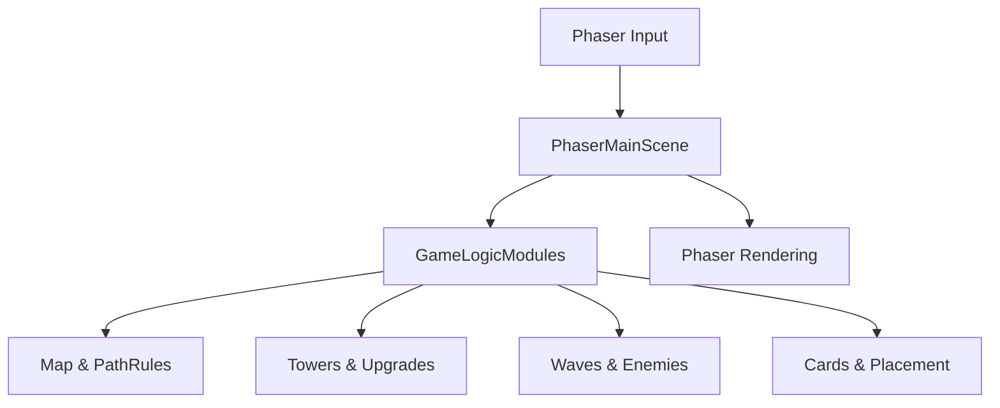

# Bound by Placement – Phaser 3 MVP Plan

## Overview

- **Engine**: Phaser 3 (CDN include), single main game instance.
- **Approach**: Phaser handles **loop, rendering, input, scene lifecycle**; game rules live in **engine-agnostic JS modules**.
- **Target**: Browser, 60 FPS, simple 2D visuals, deterministic tower-defense roguelite per your design doc.

## File & Module Structure

- **`index.html`**
  - Include Phaser 3 via CDN.
  - Create container `

` for the Phaser canvas.
  - Include `src/main.js` as a module.

- **`src/main.js`**
  - Define `Phaser.Game` config (width, height, background color).
  - Register scenes (initially only `MainScene`).
  - Start `MainScene`.

- **`src/scenes/MainScene.js`**
  - **`preload()`**: Optional loading (fonts, future sprites); MVP can use built-in shapes.
  - **`create()`**:
    - Initialize `gameState` (grid, spawn/exit, towers, enemies, gold, HP, wave, phase).
    - Create Phaser visuals for the grid (rectangles for tiles) and HUD text for gold/wave/HP.
    - Set up input: `pointerdown` to convert clicks to grid cells or UI.
    - Kick off first build/card phase or initial road setup.
  - **`update(time, delta)`**:
    - Run a **fixed-step simulation** inside (accumulator at ~16ms per tick) to stay deterministic.
    - Call pure logic systems in order: waves → enemies → towers/combat → projectiles → phase transitions.
    - Sync logical positions (enemies, projectiles) to Phaser display objects.

- **`src/core/gameState.js`**
  - Central state object, no Phaser references:
    - Grid size and 2D tiles array.
    - Lists: towers, enemies, projectiles.
    - Economy: gold, base HP.
    - Progress: currentWave, waveConfig/enemyCount.
    - Phase: `"wave" | "card" | "build" | "end"`.
    - Card draw/choice state and upgrade data per tower.

- **`src/map/grid.js`**
  - Represent grid as 2D array of tiles:
    - Tile types: `plain`, `hill`, `road_straight`, `road_turn_small`, `road_turn_long`.
    - Each road tile stores entry/exit directions to support path rules.
  - Expose helpers:
    - `createInitialGrid(sizeX, sizeY)` (start 5×5 plain).
    - `expandGridIfNeeded(grid, cell)` for outward expansion on placement.

- **`src/map/pathRules.js`**
  - Maintain and validate **exactly one continuous road** connecting spawn→exit:
    - Given tentative road placement (type, orientation, cell), check:
      - Alignment of road connections with neighbors.
      - Connectivity from spawn to exit via graph traversal.
      - No extra branches (each road cell has ≤2 neighbors in the path graph; spawn/exit have exactly 1).
    - Provide APIs:
      - `canPlaceRoad(grid, spawn, exit, pos, roadType, orientation)` → boolean + reason.
      - `applyRoadPlacement(...)` to mutate grid and recompute ordered path list.

- **`src/map/placement.js`**
  - Shared placement logic:
    - Validate tower placement (non-road, inside grid).
    - Validate terrain placement (cannot overwrite roads).
    - Trigger grid expansion if placement is at current border.

- **`src/entities/tower.js`**
  - `ArrowTower` class with:
    - Base stats: damage, fire rate, range, cost.
    - Runtime: position (grid coordinates), cooldown timer, unlockedPath, purchasedUpgrades.
  - At construction, query surrounding tiles + underlying tile:
    - Derive **exactly one** unlocked path: Precision / Angle / Sustained / Sniper.

- **`src/entities/enemy.js`**
  - `Enemy` class:
    - HP, speed, pathIndex, pathProgress.
    - Uses a **precomputed world-space path array** derived from road tiles.

- **`src/entities/projectile.js`**
  - Simple projectile model:
    - Position, velocity or target reference, damage, flags for pierce/crit (future-proof).

- **`src/systems/waveSystem.js`**
  - Manages waves per design:
    - Single enemy type, fixed spawn interval.
    - Increasing count per wave and HP scaling (+1 HP every 2 waves).
    - On death: +1 gold; on escape: −1 base HP.
    - Emits events/flags when wave starts/ends to toggle phases and enable card drawing.

- **`src/systems/combatSystem.js`**
  - Per tick:
    - For each tower: if off cooldown, scan enemies within range (grid/world distance) and fire.
    - Spawn `Projectile` objects.
    - Update projectile positions and check collisions with enemies.
    - Apply damage and upgrade effects (crit, pierce, bleed, slow, etc. as supported by tree levels).

- **`src/systems/cardSystem.js`**
  - Card definitions: road tiles, Arrow Tower, Hill terrain.
  - Each round:
    - Draw 3 random cards (with replacement for MVP) and expose them to UI.
    - After player chooses 1, update `gameState` to specify **pending placement type**.

- **`src/systems/economySystem.js`**
  - Gold helpers: `addGold`, `canAfford`, `spendGold`.
  - Integrate into waves (rewards), combat (kills), and upgrades.

- **`src/systems/upgradeSystem.js`**
  - Define upgrade trees per path, each with 3 levels:
    - Precision, Angle, Sustained, Sniper (as in your doc).
  - For a given tower:
    - Return available next upgrade (if any) and cost.
    - Apply upgrade, modifying tower stats; ensure no cross-path mixing and no refunds.

- **`src/render/gridRenderer.js`**
  - Helper for `MainScene`:
    - Create Phaser rectangles for each tile.
    - Color-code: plain, hill, road types, spawn, exit.
    - Expose `drawGrid(scene, grid)` and `updateTile(scene, grid, pos)`.

- **`src/render/entityRenderer.js`**
  - Link logic entities with Phaser objects:
    - Create basic shapes/sprites for towers, enemies, projectiles.
    - Maintain mappings (`enemy.id → sprite`) and sync positions each frame.

- **`src/ui/hud.js`**
  - Either Phaser text or DOM overlay:
    - Show gold, wave, base HP.
    - Show simple status messages ("Card Phase", "Wave X", "Upgrades available").

- **`src/ui/cardPanel.js`**
  - DOM-based panel:
    - At card phase, list 3 cards with title/icon and short description.
    - On click, notify `MainScene`/`cardSystem` of selection, hide panel, enter placement mode.

- **`src/ui/upgradePanel.js`**
  - DOM or Phaser UI for per-tower upgrades:
    - On tower click, show its unlocked path and available next level.
    - Show cost and short description; grey out if unaffordable.

- **`src/input/mouse.js`** (optional helper)
  - Convert pointer coordinates from Phaser to grid cell indices.
  - Provide utilities like `getCellFromPointer(pointer, cellSize)`.

## Implementation Steps (Phaser-Focused)

1. **Bootstrap Phaser & Basic Grid Rendering**

   - Add `index.html` with Phaser CDN and `main.js`.
   - Implement `main.js` and a bare `MainScene` that:
     - Creates a 5×5 grid of plain tiles using rectangles.
     - Shows static HUD text placeholders.

2. **Grid, Path Rules & Road Placement**

   - Implement `grid.js`, `pathRules.js`, and `placement.js` as pure logic modules.
   - Hook pointer clicks in `MainScene` to attempt road placement using `canPlaceRoad`.
   - Show visual feedback (e.g. color change or outline) for valid vs invalid placements.
   - Maintain ordered path from spawn to exit.

3. **Enemy Path Traversal & Wave Skeleton**

   - Implement `Enemy` and `waveSystem.js`:
     - Spawn enemies at the path start with HP and speed.
     - Move them along the precomputed path each tick.
     - On reaching exit, reduce base HP and destroy enemy.
   - Wire to Phaser sprites and confirm movement looks correct.

4. **Arrow Towers & Combat**

   - Implement `ArrowTower` and `combatSystem.js`:
     - Place towers on non-road tiles.
     - Determine upgrade path at placement time based on neighbors and terrain.
     - Implement basic targeting and projectile firing with hit resolution.
   - Draw towers and projectiles via Phaser shapes.

5. **Wave System Details & Phase Handling**

   - Flesh out waves: increasing counts, HP scaling (+1 every 2 waves), spawn intervals.
   - Track enemies remaining and detect wave end.
   - Introduce `phase` switching between `"wave"` and `"card"`/`"build"`.

6. **Cards & Placement Flow**

   - Implement card definitions and `cardSystem.js` draw logic.
   - Implement `cardPanel.js` UI (DOM overlay) that:
     - Shows 3 cards at wave end.
     - Calls back into `MainScene` with chosen card.
   - Implement placement modes for selected card type (road, tower, hill).

7. **Upgrades & Economy Integration**

   - Implement `upgradeSystem.js` with the four paths and 3 levels each.
   - Implement `upgradePanel.js` UI for tower upgrades.
   - Use `economySystem.js` to enforce gold costs and update gold on kills and upgrades.

8. **HUD, End Screen & Polish**

   - Finalize HUD (gold, wave, HP, phase indicator).
   - Add end-of-run summary UI (wave reached, enemies killed, towers built, upgrade paths used).
   - Light tuning of values so:
     - Game is readable and fun by wave 5.
     - Full 15-wave run is <30 minutes.

## Notes & Constraints

- **Determinism**: Use your own fixed-step logic inside `update` and avoid Phaser physics to keep behavior predictable.
- **Simplicity first**: Flat colors, rectangles/circles, and DOM panels are enough for MVP.
- **Extensibility**: Logic modules are engine-agnostic so later refactors (e.g. more towers/enemies) stay manageable.

